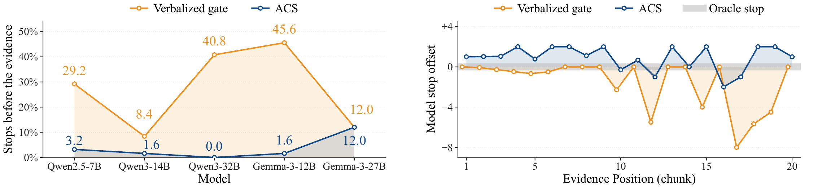
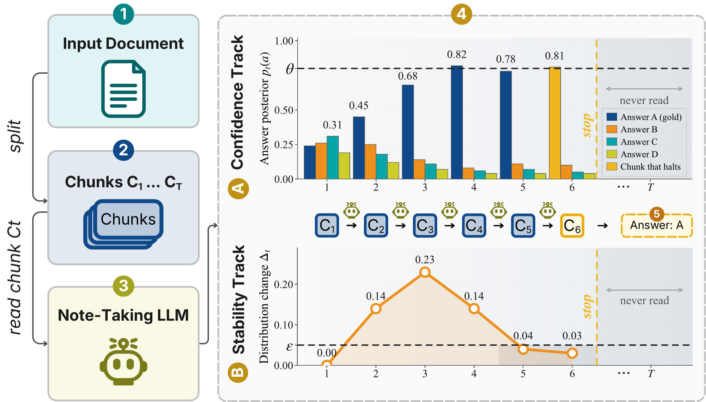

# ACS: Answer-Convergence Stopping
**Authors:** Muath Alyobi, Mohamed Eltahir, Almoayyad Abuljdail, Riyadh Almutawa, Tanveer Hussain and Naeemullah Khan.

<div align="center">

[](https://arxiv.org/abs/2609.34590)
[](LICENSE)

</div>

<div align="center">
  
  <p><em><b>Left:</b> share of S-NIAH runs that stop before reaching the evidence, across five models. <b>Right:</b> model stop offset against evidence position (chunk), with the oracle stop shaded. ACS is shown in blue and the verbalized gate in orange.</em></p>
</div>

---

Answer-Convergence Stopping (ACS) is a training-free controller for stopping long-context reading when the
model's answer is both confident and stable. This repository contains the
online runner, benchmark preparation code, evaluation utilities, and scripts
used for the reported experiments.

## Highlights

- Works with multiple-choice and open-answer tasks.
- Uses one shared setting: `theta=0.995`, `epsilon=0.05`, and `window=3`.
- Supports OpenRouter and compatible local vLLM servers.
- Provides resumable trajectory recording and offline policy replay.
- Includes LongBench-v2, S-NIAH, RULER-HotpotQA, and BrowseComp-Plus adapters.

---

## Methodology

<div align="center">
  
  <p><em>Overview of ACS. The document is processed sequentially in chunks while a frozen model maintains running notes. After each chunk, a separate probe produces the current answer state b<sub>t</sub> and confidence c<sub>t</sub>, and consecutive answer states define the change δ<sub>t</sub>. The stopping rule halts at the first step where c<sub>t</sub> ≥ θ and the mean change Δ<sub>t</sub> over the last min(t, w) answer states satisfies Δ<sub>t</sub> ≤ ε.</em></p>
</div>

---

## Repository structure

```text
ACS/
├── benchmark_data/   # dataset builders
├── configs/          # released configurations
├── eval/             # policy replay and evaluation
├── experiments/      # benchmark-specific scripts and ablations
├── common.py         # API, scoring, and I/O utilities
├── draft_cleaner.py  # non-answer detection
├── prepare_data.py   # shared dataset preparation
└── run_fold.py       # trajectory recorder and online ACS controller
```

Generated `data/`, `results/`, `checkpoints/`, caches, and credentials are
excluded from version control.

---

## Installation

Python 3.10 or newer is required.

```bash
python -m venv .venv
source .venv/bin/activate
python -m pip install --upgrade pip
python -m pip install -r requirements.txt
```

On PowerShell, activate with:

```powershell
.\.venv\Scripts\Activate.ps1
$env:OPENROUTER_API_KEY = "YOUR_KEY"
```

Never place credentials in YAML or JSONL files.

---

## Quick start

Prepare a supported benchmark:

```bash
python ACS/prepare_data.py sniah --config ACS/configs/sniah_full.yaml
```

Record complete trajectories for paired offline comparison:

```bash
python -u ACS/run_fold.py \
  --data data/sniah.jsonl \
  --out results/sniah_full.jsonl \
  --config ACS/configs/sniah_full.yaml \
  --workers 8 --rule none --record-verbalized --record-gate
```

Replay and evaluate the policies:

```bash
python ACS/eval/add_oracle_labels.py results/sniah_full.jsonl data/sniah.jsonl
python ACS/eval/analyze.py policies \
  --traj results/sniah_full.jsonl --config ACS/configs/sniah_full.yaml
python ACS/eval/analyze.py evidence \
  --traj results/sniah_full.jsonl --config ACS/configs/sniah_full.yaml
```

The reproduction workflow is: prepare benchmark JSONL, record complete trajectories with --rule none,
add deterministic evidence labels when needed, and evaluate the saved trajectories
offline.

---

## Use ACS online on a new dataset

Each input line must be one JSON object with a unique `id`, a non-empty
`question` and `context`, and `task_shape` set to `open` or `mcq`. MCQ rows
must also provide choices `A`, `B`, `C`, and `D`.

```json
{"id":"example-1","task_shape":"open","question":"Who founded the organization?","context":"Long context...","answer":"Reference answer","answer_type":"string"}
```

Reference answers are used only for later evaluation. The runner does **not** put `answer`, `answers`, `evidence_char_starts`, or other gold fields into model prompts.

Copy a released configuration and retain these online settings:

```yaml
fold:
  chunk_chars: 24000
  notes_chars: 6000
  notes_tokens: 1500
  draft_tokens: 32

online_stop:
  rule: windowed
  theta: 0.995
  eps: 0.05
  window: 3
  min_chunks: 2
  record_verbalized: false
  record_gate: false
```

Run one smoke-test sample, then the full dataset:

```bash
python -u ACS/run_fold.py \
  --data data/custom.jsonl --out results/custom_smoke.jsonl \
  --config ACS/configs/custom_online.yaml \
  --workers 1 --limit 1 --rule windowed

python -u ACS/run_fold.py \
  --data data/custom.jsonl --out results/custom_online.jsonl \
  --config ACS/configs/custom_online.yaml \
  --workers 8 --rule windowed
```

Rerunning the same command resumes completed work. Use a new output file when
changing the model, dataset, endpoint, chunking, or stopping configuration.

### Local vLLM

```bash
vllm serve "YOUR_HUGGINGFACE_MODEL_ID" \
  --host 127.0.0.1 --port 8000 \
  --api-key local-acs --generation-config vllm --max-logprobs 20
```

Point the YAML `server.base_url` to `http://127.0.0.1:8000/v1`. The runner
checks constrained decoding and required log probabilities before inference.

---

## Reproduce the experiments

### LongBench-v2

```bash
python ACS/prepare_data.py longbench_v2 --config ACS/configs/longbench_full.yaml
python -u ACS/run_fold.py \
  --data data/longbench_v2_all.jsonl \
  --out results/longbench_full.jsonl \
  --config ACS/configs/longbench_full.yaml \
  --workers 8 --rule none --record-verbalized --record-gate
python ACS/eval/analyze.py policies \
  --traj results/longbench_full.jsonl \
  --config ACS/configs/longbench_full.yaml --verbalized-at 99.5
```

### Five-model S-NIAH

```bash
cd ACS/experiments/sniah_five_model
python -u run_five_models.py --model all --workers 8 --prepare
python -u analyze_five_model_table.py
python -u analyze_parameter_selection.py
```

For the Qwen3-14B folding ablations:

```bash
cd ACS/experiments/sniah_ablations
python -u run_sniah_ablations.py \
  --arms base24_notes6 chunk12 chunk48 notes3 notes12 \
  --workers 8 --prepare
python -u analyze_sniah_ablations.py
```

### RULER-HotpotQA

From `ACS/experiments/ruler_hotpotqa/`, generate the official RULER `qa_2`
pool using:

```bash
python -u generate_official_ruler_data.py \
  --repo-dir official_ruler --output-root official_ruler_qwen3_14b \
  --tokenizer-type hf --tokenizer-path Qwen/Qwen3-14B \
  --lengths 8192 16384 32768 65536 131072 --num-samples 500
```

Then use `prepare_ruler_hotpotqa.py`, `../../run_fold.py`, and
`analyze_ruler_hotpotqa.py` for cohort selection, trajectory recording, and
evaluation respectively.

### BrowseComp-Plus

```bash
cd ACS/experiments/browsecomp_plus
python -u prepare_browsecomp_all830.py
python -u run_browsecomp_all830.py --arm qwen35 --workers 8 --confirm-paid-run
python -u analyze_browsecomp_all830.py \
  --arm qwen35 --judge-model qwen/qwen3-32b
```

Available arms are `qwen14`, `qwen35`, and `kimi`. Use the same validated judge
for every arm.

---

## Configuration

The released ACS constants are:

| Parameter | Value |
|---|---:|
| Chunk size | 24,000 characters |
| Notes cap | 6,000 characters |
| Confidence threshold | 0.995 |
| Stability tolerance | 0.05 |
| Stability window | 3 states |
| Minimum chunks | 2 |

With `window=3`, the first eligible stopping point is step 3. Empty,
abstaining, or low-confidence open-answer drafts reset the stability window.

---

## Validation

Before running or publishing changes:

```bash
python validate_release.py
python -m unittest -v test_release_semantics.py
```

The validator checks the repository structure, configuration invariants,
syntax, anonymity patterns, and excluded private/generated files.

---

## Citation

If you use ACS in your research, please cite:

```bibtex
@misc{alyobi2026modelknowsstop,
      title={The Model Knows When to Stop: Training-Free Early Stopping for Long-Context Reading},
      author={Muath Alyobi and Mohamed Eltahir and Almoayyad Abuljdail and Riyadh Almutawa and Tanveer Hussain and Naeemullah Khan},
      year={2026},
      eprint={2609.34590},
      archivePrefix={arXiv},
      primaryClass={cs.CL},
      url={https://arxiv.org/abs/2609.34590},
}
```
